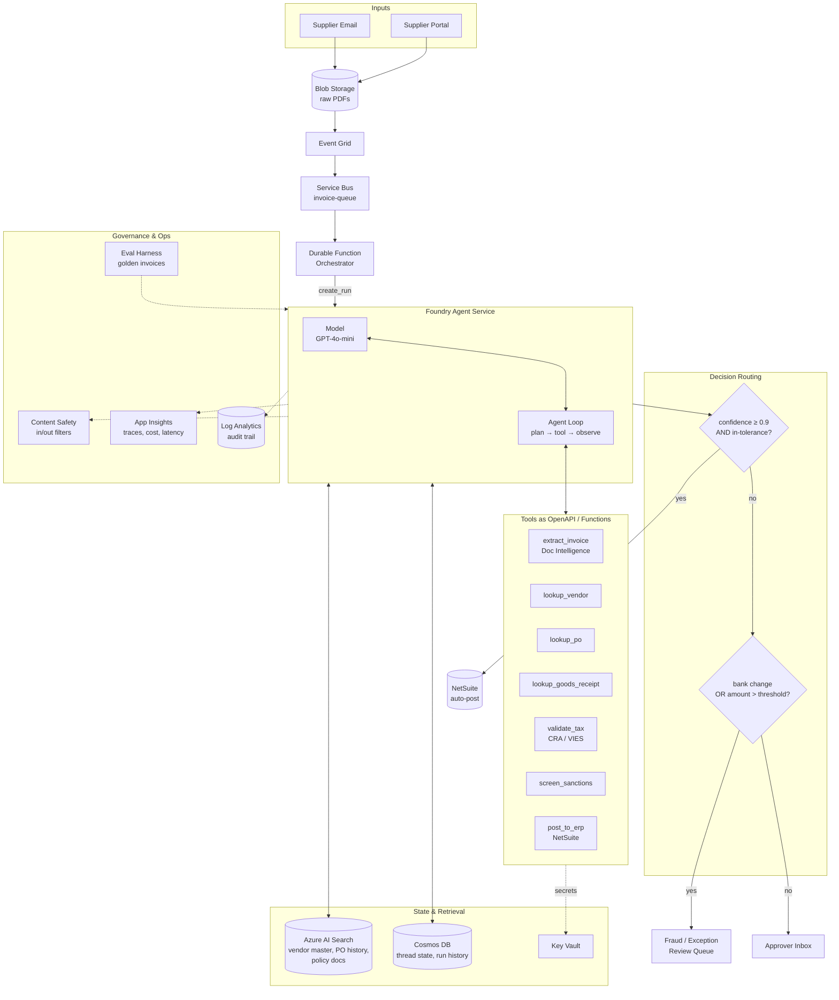

# Invoice Approval Agent — Reference Architecture

**Pattern:** Event-driven async agent (no chat UI)
**Runtime:** Azure AI Foundry Agent Service on `canadacentral`
**Build-time tools:** Claude Code (authoring, reasoning, evals) + GitHub Copilot (Azure plumbing)
**Status:** Reference design v1

---

## 1. Business Context

Accounts Payable teams process thousands of supplier invoices monthly. Most are routine three-way matches (invoice ↔ PO ↔ goods receipt), but humans still touch every one because exceptions hide inside routine volume. Industry baseline: ~$10–15 fully-loaded cost per invoice manually, ~$2–3 with good automation.

The agent's job is to handle the routine cases straight-through, surface exceptions with full reasoning attached, and never auto-approve anything that violates risk policy — regardless of model confidence.

**Target outcomes**

- Straight-through processing for 60–75% of invoices (mature state)
- Bank-detail-change fraud caught at 100% (always human-reviewed)
- p95 latency under 30 seconds per invoice
- Cost per invoice processed under $0.05 in model + tool spend
- Full audit trail per SOX and AIDA requirements

---

## 2. Architecture Diagram



---

## 3. The Five-Piece Anatomy

Every production agent reduces to these five pieces. This one is no exception.

**Trigger.** Supplier email or portal upload lands a PDF in Blob Storage. Event Grid fires, Service Bus queues, a Durable Function picks up the message and invokes the agent. The Durable Function owns retries, dead-letter, and human-approval waits — not the agent.

**Model + system prompt.** GPT-4o-mini handles the bulk economically; complex or low-confidence cases escalate to a stronger model. System prompt defines the role ("AP analyst agent"), the tool-use discipline, the output schema, and the hard constraints (never post above approver threshold, never auto-approve on bank change).

**Tools.** Seven typed functions exposed as OpenAPI specs and implemented as Azure Functions with managed identity. Tool design is the highest-leverage architecture decision here — clean schemas, structured errors, idempotency, and authorization scoping.

**Memory and state.** Cosmos DB holds thread state and run history. Azure AI Search holds the vendor master, PO history, and policy documents — retrieved, not trained. Policy updates require no retraining.

**Guardrails.** Content safety on input and output. Two-gate decision routing (confidence then policy). Full structured audit log. Human-in-the-loop for any decision below the confidence threshold or above the policy threshold.

---

## 4. Tool Catalog

| Tool | Purpose | Implementation | Auth scope |
|---|---|---|---|
| `extract_invoice` | OCR + field extraction from PDF | Azure Document Intelligence | Read blob, write structured |
| `lookup_vendor` | Resolve supplier from tax ID and name | Azure Function → NetSuite read API | Read-only vendor master |
| `lookup_po` | Fetch purchase order details | Azure Function → NetSuite read API | Read-only PO data |
| `lookup_goods_receipt` | Confirm what was actually received | Azure Function → NetSuite read API | Read-only GR data |
| `validate_tax` | Verify tax ID against registry | Azure Function → CRA / VIES | Outbound HTTPS |
| `screen_sanctions` | Sanctions list check on supplier | Azure Function → OFAC/SDN feed | Outbound HTTPS |
| `post_to_erp` | Write invoice to NetSuite | Azure Function → NetSuite write API | Scoped write, idempotent |

Tool design rules followed: each tool has a single responsibility, returns a structured error envelope on failure, accepts an idempotency key, and never assumes the agent will call it twice in the same way.

---

## 5. Decision Routing

The agent does not directly write to the ERP. It produces a structured decision:

```json
{
  "decision": "auto_approve | route_for_approval | hold_for_exception | reject",
  "confidence": 0.0,
  "reasons": ["3-way match within tolerance", "supplier verified"],
  "flags": ["bank_details_changed"],
  "route_to": "ap_clerk_queue | manager_approver_id | fraud_review",
  "posting_payload": { "...ERP-ready fields..." }
}
```

Two policy gates evaluate that decision:

**Gate 1 — Quality gate.** Confidence ≥ 0.9 AND quantities/prices within configured tolerance? If no, drop to Gate 2.

**Gate 2 — Risk gate.** Bank details changed from vendor master? OR amount above auto-approve threshold? OR new supplier? OR sanctions hit? If yes, route to fraud/exception queue. If no, route to the approver inbox with the agent's reasoning attached.

Only invoices that clear both gates auto-post.

---

## 6. Governance Mapped to NIST AI RMF

| RMF Function | Architectural manifestation |
|---|---|
| **Govern** | Risk policy encoded as decision gates; approver thresholds in config not prompt; audit trail to Log Analytics; quarterly review cadence on prompts and tools |
| **Map** | Use case registered in enterprise AI inventory; data classification on inputs (supplier PII) and outputs (financial postings); SOX scoping documented |
| **Measure** | Eval harness with golden invoices; quality metrics (precision/recall on auto-approve), reliability (p95 latency, error rate), cost (tokens per invoice), safety (false-approve rate) |
| **Manage** | Content safety filters in production; rollback path via Foundry deployment slots; on-call runbook for agent incidents; human override always available |

This is the bullet from a typical AI Architect job description — *"embed governance in architecture, not paperwork"* — made literal.

---

## 7. Where Claude Code and Copilot Fit

Build-time only. Neither runs in production.

| Task | Claude Code | Copilot |
|---|---|---|
| System prompt, agent spec, ADRs | ✓ | |
| Tool schema design and trade-offs | ✓ | |
| Eval datasets and judge prompts | ✓ | |
| Azure Function bindings, Bicep, SDK glue | | ✓ |
| Inline completion in VS Code | | ✓ |
| Refactors across the agent code | ✓ | ✓ |

If tools are defined as MCP servers, the same tool definitions are reusable by Claude Code (for testing), Copilot agent mode (for build-time exploration), and the production agent runtime. One source of truth, three consumers.

---

## 8. Data Residency Note

All resources provisioned in `canadacentral`:

- Azure OpenAI / Foundry model endpoints (or Claude via Bedrock `ca-central-1` if Claude is the model)
- Blob, Cosmos, AI Search, Service Bus, Functions, Key Vault, App Insights, Log Analytics

No tool invocation, no document, and no telemetry crosses the region boundary. This is the structural argument for the build — not "we trust the vendor's promise," but "the request path cannot leave the region by construction."

---

## 9. What This Reference Design Deliberately Does Not Cover

- Supplier onboarding workflow (separate agent or human process)
- Disputes and credit memos (separate flow with different SLAs)
- Multi-entity / multi-currency consolidation rules (handled in ERP, not agent)
- Long-term supplier relationship intelligence (out of scope for transactional agent)

Future iterations can compose additional agents alongside this one. The Durable Function orchestrator is the natural seam.

---

## 10. Next Artifacts

- Sequence diagram for one invoice's run through the loop
- Eval harness specification with golden-set examples
- Bicep module for the full resource set
- Threat model (STRIDE) for the agent and its tools
- Cost model with token economics and tool call pricing
