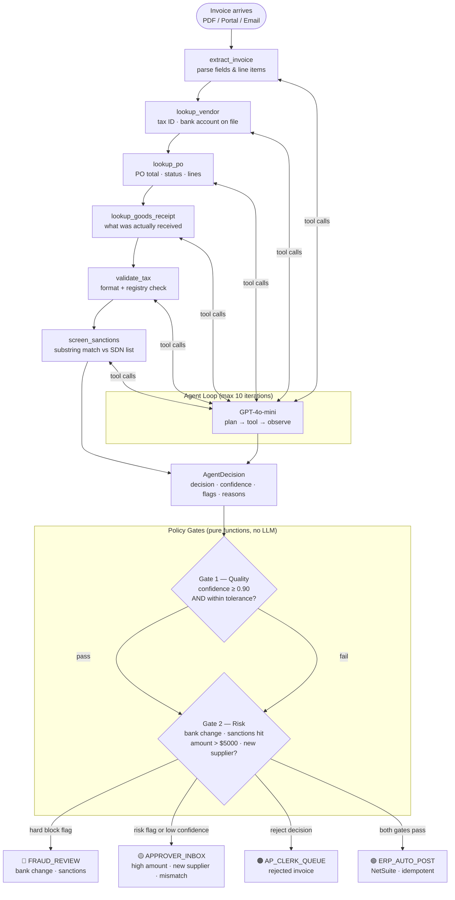
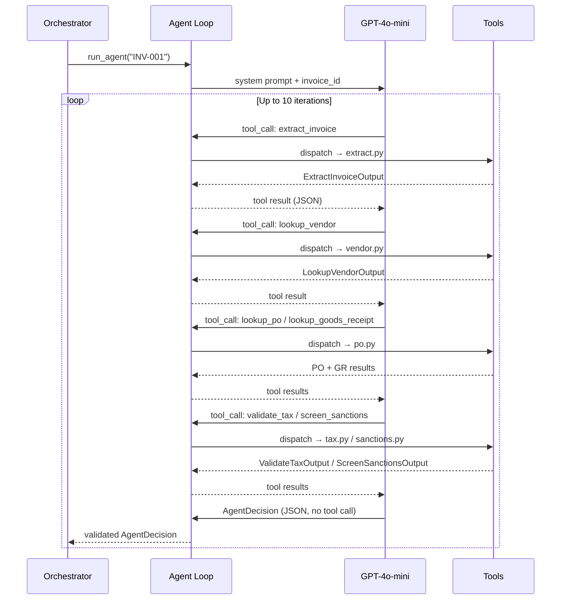
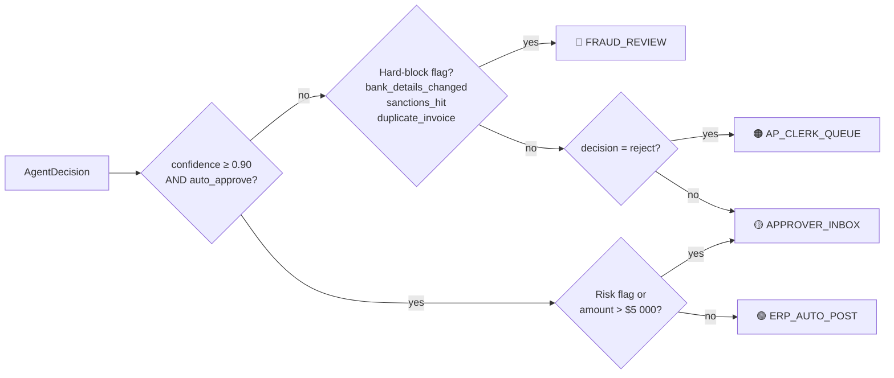
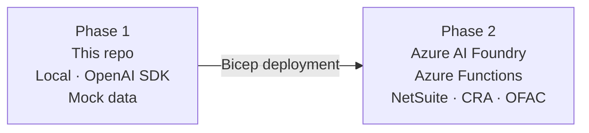

# Invoice Approval Agent

An event-driven AI agent that processes supplier invoices end-to-end: extracts fields, performs a three-way match (invoice ↔ PO ↔ goods receipt), screens for fraud signals, and produces a structured routing decision enforced by deterministic policy gates.

**Stack:** Python 3.11 · Pydantic v2 · OpenAI function-calling · pytest

**Test status:** 14 gate tests · 14 tool tests · 28/28 passing

---

## Architecture

### End-to-End Flow



---

### Agent Loop Detail



---

### Decision Routing



---

## Tool Catalog

| Tool | File | Responsibility | Auth scope |
|------|------|----------------|------------|
| `extract_invoice` | `src/tools/extract.py` | Read pre-parsed JSON (prod: Azure Doc Intelligence) | Read blob |
| `lookup_vendor` | `src/tools/vendor.py` | Exact tax-ID match or name substring; returns `bank_account_on_file` | Read-only vendor master |
| `lookup_po` | `src/tools/po.py` | Fetch PO by number; returns cancelled POs so agent can react | Read-only PO data |
| `lookup_goods_receipt` | `src/tools/po.py` | Confirm what was received; `GR_NOT_FOUND` is informational | Read-only GR data |
| `validate_tax` | `src/tools/tax.py` | Format regex + registry lookup; `ok` ≠ `valid` by design | Outbound HTTPS |
| `screen_sanctions` | `src/tools/sanctions.py` | Conservative substring match; false positives go to human | Outbound HTTPS |
| `post_to_erp` | `src/tools/erp.py` | Idempotent write; `erp_document_id = "NS-" + sha256(key)[:12]` | Scoped ERP write |

> `post_to_erp` is called by the **orchestrator** after gates pass, not by the agent itself.

---

## Policy Configuration

All thresholds live in `src/gates/policy.py` — plain data, no logic:

| Setting | Value |
|---------|-------|
| Auto-approve confidence floor | `0.90` |
| Auto-approve amount limit | `$5,000 CAD` |
| Hard-block flags (→ FRAUD_REVIEW) | `bank_details_changed`, `sanctions_hit`, `duplicate_invoice` |
| Risk flags (→ APPROVER_INBOX) | `new_supplier`, `tax_invalid`, `math_mismatch`, `no_po`, `po_mismatch` |
| Price match tolerance | ±2% |
| Quantity match tolerance | ±5% |

---

## Golden Invoice Test Cases

| Invoice | Expected Route | Scenario |
|---------|---------------|----------|
| INV-001 | `ERP_AUTO_POST` | Clean 3-way match |
| INV-002 | `FRAUD_REVIEW` | Bank account changed from vendor master |
| INV-003 | `APPROVER_INBOX` | Invoice total doesn't match line-item math |
| INV-004 | `APPROVER_INBOX` | Amount exceeds $5,000 auto-approve limit |
| INV-005 | `APPROVER_INBOX` | No PO reference on invoice |
| INV-006 | `FRAUD_REVIEW` | Supplier name matches sanctions list |

---

## Quick Start

```bash
# 1. Install
pip install -e ".[dev]"

# 2. Configure
cp .env.example .env
# Add your OPENAI_API_KEY to .env

# 3. Verify tests (28 should pass, no API key needed)
python3 -m pytest

# 4. Run a single invoice end-to-end
python -m src.agent.demo INV-001

# 5. Run all 6 golden cases
for id in INV-001 INV-002 INV-003 INV-004 INV-005 INV-006; do
    echo "--- $id ---"
    python -m src.agent.demo $id
done

# 6. Run the eval harness
python -m evals.run_evals
```

---

## Repo Layout

```
src/
  agent/
    loop.py            # tool dispatch, message history, max-iteration guard
    demo.py            # CLI entry point
    schemas.py         # every Pydantic contract — read this first
    system_prompt.md   # agent operating discipline
    tools_registry.py  # single source of truth for tool registration
  tools/
    extract.py         # ✅ implemented
    vendor.py          # ✅ implemented
    po.py              # ✅ implemented
    tax.py             # ✅ implemented
    sanctions.py       # ✅ implemented
    erp.py             # ✅ implemented
  gates/
    policy.py          # thresholds and flag sets (data only)
    routing.py         # quality_gate · risk_gate · route (pure functions)
  data/
    invoices/          # INV-001 through INV-006 (pre-parsed JSON)
    vendor_master.json
    pos.json           # purchase orders + goods receipts
    tax_registry.json
    sanctions_list.json
evals/
  golden_set.jsonl     # expected routes for each invoice
  run_evals.py         # replay harness
tests/
  test_gates.py        # 14 tests — gates are pure, full coverage
  test_tools.py        # 14 tests — one per tool function + edge cases
```

---

## Production Roadmap (Phase 2)



- Replace `extract_invoice` stub → Azure Document Intelligence
- Replace mock data files → NetSuite read APIs
- Replace static sanctions list → OFAC SDN live feed + phonetic matching
- Add Cosmos DB for thread state and audit trail
- Add App Insights for token cost and latency telemetry
- Wrap tools as MCP server (reusable by Claude Code, Copilot, and prod runtime)
